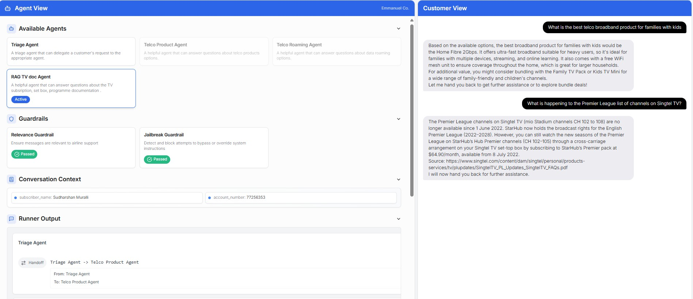
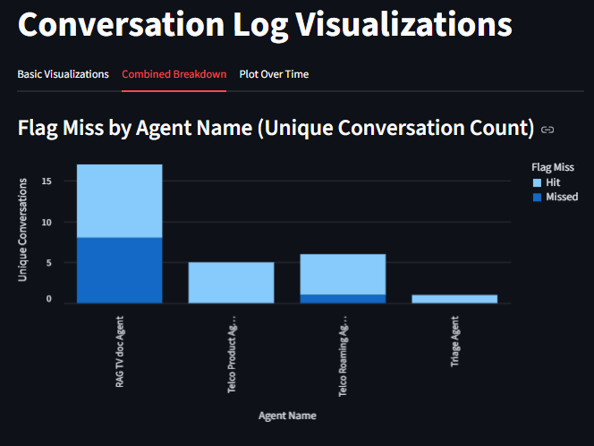
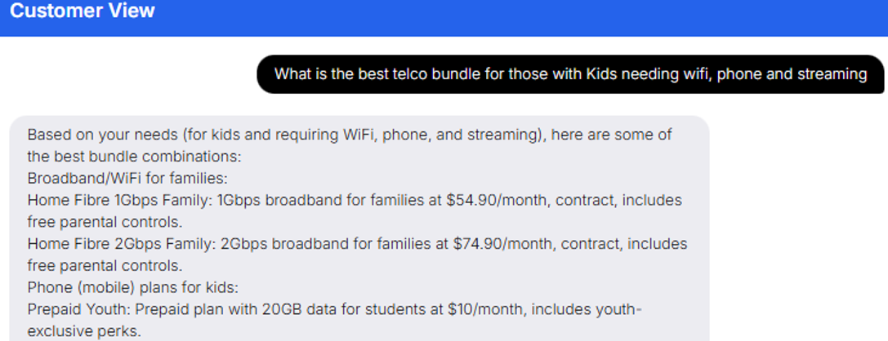
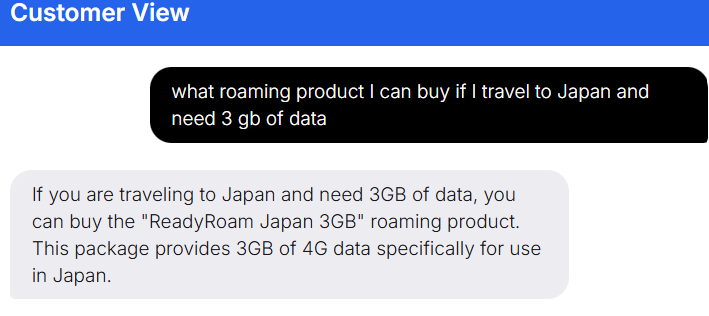
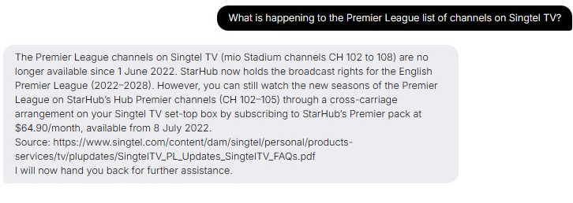
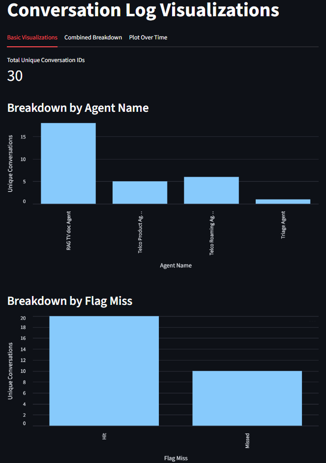

# Telco Customer Service Agents Demo Tool description

This chat tool Customer Service Agent for an imaginary Telco Company. A triage agent orchestrates the following 3 agents

1. **Telco Product Agent** - A simple telco product recommender (bundles, phones, broadband etc)
2. **Telco Roaming Agent** - Roaming data recommender for customers wanting to travel
3. **RAG TV Doc Agent** - A simple agent that grounds it answers on 2 online pdf documents [doc1](https://www.singtel.com/content/dam/singtel/personal/products-services/tv/plupdates/SingtelTV_PL_Updates_SingtelTV_FAQs.pdf) and [doc2](https://cdn2.singteldigital.com/content/dam/singtel/personal/products-services/tv/apps/tv-go/tv-go-documents/singteltvgo-faqs.pdf)




A **streamlit app** also tracks the usage, breakdown by agent usage and hit/miss and usage breakdown over time




## How to Set-Up

### Setting your OpenAI API key

Create the .env file inside python-backend directory and write your api key
```bash
OPENAI_API_KEY="your_api_key"
```
You will need to install the `python-dotenv` package to load the environment variables from the `.env` file.

### Install dependencies

Install the dependencies for the backend by running the following commands:

Linux:
```bash
cd python-backend
python -m venv .venv
source .venv/bin/activate
pip install -r requirements.txt
```
Note: For windows, change third command line to .venv\Scripts\activate

After installing all the python dependencies, you'll need to vectorize 2 document links and save it to a persistent VectorDB by running
```bash
python pdf_to_vecstore_faiss.py
```

For the react app UI, you can run. Note an npm :

```bash
cd ui
npm install
```

### Run the app

You can either run the backend independently if you want to use a separate UI, or run both the UI and backend at the same time.

#### Run the backend independently

From the `python-backend` folder, run in venv:

chat fast_api + agents backend
```bash
python -m uvicorn api:app --reload --port 8000
```
The chat fast_api + agents backend will be available at: [http://localhost:8000](http://localhost:8000)

streamlit app
```bash
streamlit run streamlit_dash.py --server.port 8080
```
The chat fast_api + agents backend will be available at: [http://localhost:8080](http://localhost:8080)


#### Run the UI & backend simultaneously

From the `ui` folder, run:

```bash
npm run dev
```

*note: If you are running in windows, run the backend and streamlit servers separately*

The frontend will be available at: [http://localhost:3000](http://localhost:3000)

This command will also start the backend.


## Documentation On Recommender Agents (Task 1)

### Specific Business Use Case

1. Customers will be directed to **Telco Product Agent** if they are asking about telco bundles, broadband, phone contracts pre-paid/post. A product is recommended from a list of offers from *telco_products.csv*. This is a simple conversation of table to text and concatenated in the instructions a limiting context for the tool. 
2. **Telco Roaming Agent** recommends roaming products to travelling customers. Same method was used but source of context is from *roaming_products.csv*
3. Orchestration is simple, A triage agent decides which agent handles the query. Once the query is finished, the tool is instructed to be handed back to triage
4. **Fast API and Openai-agents+Langchain backend** is integrated to a react app front end.

     

## Documentation On RAG (Task 2)

### Specific Business Use Case

A customer is re-directed to **RAG TV doc Agent** if the query is about TV FAQs on how to/technical questions or Premier League programme update. The agent is instructed to ground its answer based on the most similar document content retrieved from a Pre- Vector Stored documents. The agent was also instructed to provide source in its final answer.




### Documentation on RAG Approach (Task 2)

**Spliting, Vectorizing and Storing Using Lang Chain:**

PDF Files --> PDF Loader --> Splitting Text (1000 chunksize and 200 overlap) --> Vectorize using OpenAI embedding model --> Vector Store using FAISS (*Saved to Local to avoid raking embedding API charges*)

**Retrieving and Feeding To Agent**

Similarity Search --> Defined OpenAi-Agent tool to use this search based on chat query --> The RAG agent is instructed to use this defined to ground its answer based on page_content AND specify source based on source metadata (example: https:\\www.FAQs....pdf)

**Some Proposed Technique to improve/Fine Tune **

1. Apply some cleaning in the loaded file to remove some unwanted formatting and metadata, footers etc
2. Refine the chunking/splitting process
3. Evaluate other vectorstores
4. In production, ensure PII/confidential data are note exposed to Outside APIs/Models.
5. Evaluate other approach in the agent. Current approach is just the boiler plate opeanai-agent approach with some mixture of langchain methods. 
6. Apply some unit testing for agent testing. Expected answers and documents cited on pre-defined sample queries


### Integration Strategy and Approach  (Task 3)

**POSSIBLE DEPLOYMENT METHOD**

It is possible to integrate this app into a Whatsapp Business Account using Twilio as a gateway by exposing the Chat App's Fast API endpoint to facilate incoming queries and outgoing answer to customers

**ANTICIPATED CHALLENGES**
1. Security challenges and will need to work with the company Network and information Security. It is not just network security, A governance framework should be well defined on what information can be shared with third party (API forwarder and to the LLM model host like OpenAI)
2. Scaling issue. It should be planned / estimated on what Agents will have the biggest load, Are the vecstor storage up to the demand?
3. Hallucinations.  Agents should be unit tested. An orchestrator needs to be tested if it is forwarding to an expected agent and individual agents need to be tested for correctness of answers

**METRICS TO TRACK**

Possible metrics to track are accuracy, breakdown and some NPS survey coming from direct users/customers. Tracking of accuracy maybe a data science project on its own. There may be some queries with labels on expected answers. This can be used as training set to automate some performance on top of unit testing


### Visualization Dashboard  (Task 4)

Logging each unique Conversation ID to sqliteDB(agent_events.db) --> Visualising in Streamlit (streamlit_dash).py

Note: A simple flag on missed/Hit is based on simple rule of finding I don't know or don't have in its final answer. Future classification can be improved further




